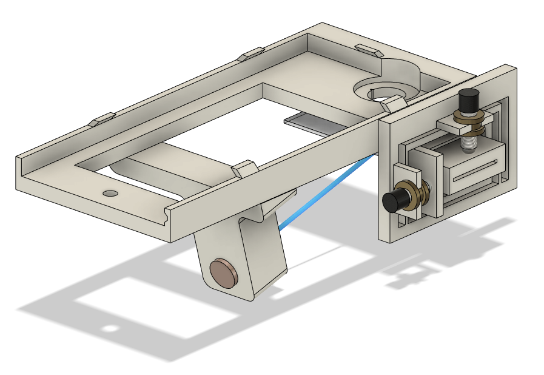
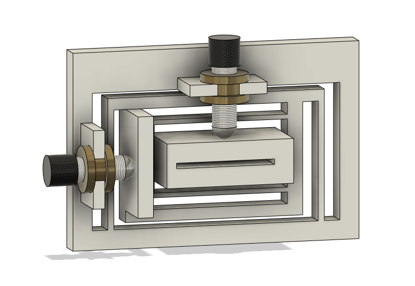
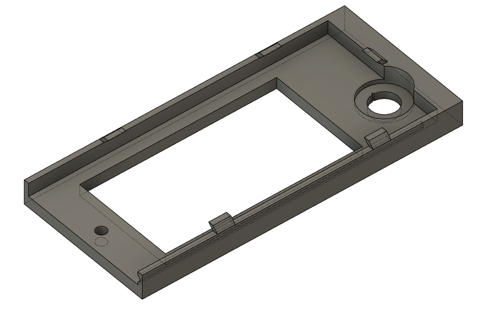

# CovidTest
##Intro
The goal of this project was to design a simple Covid-19 test by using a smartphone camera and some 3D printed components. 

##Assembled Tester

##Flexure Plate Used For Positioning Of Slide

##Phone Mount to which the laser holder and flexure plate were connected.

##Flexure Plates
The flexture plates that I designed for this project function on the same principle as the metal flexture plates used for optics. The one I designed allows for movement in both the X and Y axes with precise positioning with the micrometer drives. Allows for positioning within a range of 2x1.5mm

##Working Principle
An attempt at a smartphone based Covid-19 Test. By attaching an external lens to a regular smartphone, it was reconfigured into a microscope. We then used fluorescent particles that were designed to attach to the spike proteins on the SARS-CoV virus in order to detect the presence of viral particles. A diode laser was used as a source of illumination, which was then combined with a color filter to improve the signal to noise ratio. Finally we needed to ensure that we could position the sample with a high degree of accuracy. In order to do this I designed a 3D printable 2 axis flexure plate which allowed for micrometer level position in both the x and z axis. This was quite an achievement given that the flexure only weighs a couple grams and is made from PLA plastic. I also designed a phone case which incorporated the lens, color filter and diode laser. This handheld device was originally designed for rural communities in Africa & Asia where easy testing is not available. As a vaccine has been developed this device is no longer necessary, however it was still a very interesting project to work on!

